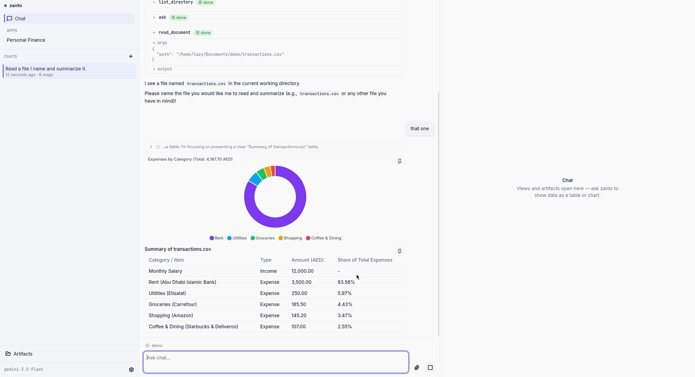
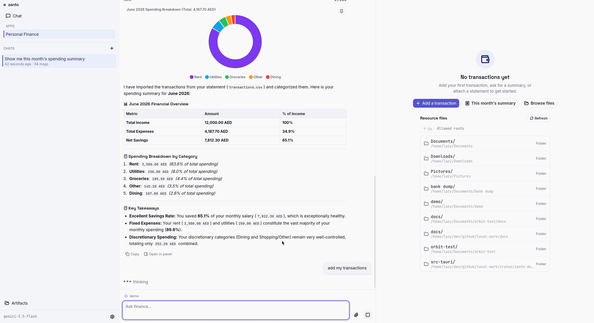
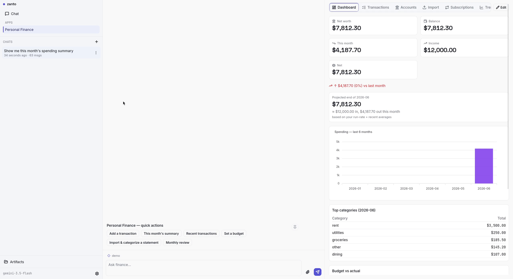

# zanto — your private, local-first AI workspace

**A private AI assistant you own — bring your own model (Claude, GPT, Gemini) or run fully offline with Ollama. Your files and keys never leave your machine.**

[](https://github.com/satyamyadav/zanto-rust/releases)
[](LICENSE)


zanto is an open-source, local-first AI assistant (desktop **and** CLI) built in Rust + Tauri — a
private alternative to cloud AI apps. Point it at your own provider key or a local **Ollama**
model, give it consented access to your files, shell, and the web, and get answers rendered as
real artifacts — charts, tables, and documents — not just text. **No cloud account. No telemetry.**

> **v1.0.0 is an early release.** The macOS build is ad-hoc signed (not yet
> notarized), so it opens with a one-time right-click → **Open** — no Terminal
> command. Windows is unsigned and shows a SmartScreen prompt on first run
> (see [Install](#install)).

## Screenshots

| Chat + artifacts | Personal Finance — import | Finance dashboard |
|---|---|---|
|  |  |  |

## Why zanto

- **You own the stack.** Bring-your-own API key (stored in the OS keychain), or
  run fully offline against local **Ollama**. No middleman server.
- **10+ providers, one app.** Anthropic, OpenAI, Gemini, Groq, xAI, DeepSeek,
  Together, Fireworks, Cohere, Ollama — switch models live and tune generation
  parameters globally or per provider.
- **Real tools, with consent.** Reads, writes, searches, and edits files; runs
  shell commands; fetches the web; parses PDFs and Office docs — every filesystem
  action is permission-gated (allow once / session / forever / deny).
- **Artifacts, not just chat.** Renders charts, tables, metrics, and documents
  inline or on a side canvas; pin the ones worth keeping.
- **Sessions that survive.** SQLite-backed, crash-safe, resumable, with automatic
  context summarization for long conversations.
- **Micro-apps.** Focused tools on the same engine — starting with a private
  **Personal Finance** app (transactions, budgets, accounts, net worth), fully local.
- **Also a CLI.** `zanto` runs in the terminal for one-shot and interactive use.

## Install

Download the latest build for your OS from the
[**Releases**](https://github.com/satyamyadav/zanto-rust/releases) page.

| OS | Artifact | First-run note |
|----|----------|----------------|
| macOS | `.dmg` (universal) | Right-click the app → **Open** → **Open** (ad-hoc signed — no Terminal command) |
| Windows | `.msi` / `.exe` (NSIS) | Unsigned: SmartScreen → **More info** → **Run anyway** |
| Linux | `.AppImage` / `.deb` | `chmod +x zanto_*.AppImage` and run, or `sudo dpkg -i zanto_*.deb` |

These prompts appear because the builds aren't notarized (macOS) or signed
(Windows) yet — Developer-ID signing and notarization are the top post-launch item.

## Quickstart

1. Launch zanto and open **Settings**.
2. Pick a **provider** and **model**, then either:
   - paste an **API key** (stored in your OS keychain), or
   - set the provider's env var before launching — e.g.
     `OPENAI_API_KEY=sk-… ` / `ANTHROPIC_API_KEY=…` / `GEMINI_API_KEY=…` — which
     zanto reads automatically; or
   - select **Ollama** and point it at your local server for a fully offline setup.
3. Grant a folder under **Folder access** so the assistant can read/write there.
4. Start chatting. File actions will ask for permission the first time.

> No Secret Service on Linux? Keychain writes will fail — set the provider env var
> instead (zanto reads it and shows the key as “Saved”).

## Build from source

Requires Rust (stable), Node.js 20+, and [pnpm](https://pnpm.io). Linux also needs
the WebKitGTK/GTK dev packages (see `.github/workflows/release.yml`).

```bash
# Desktop app (dev)
cd crates/zanto-desktop
pnpm install
pnpm run tauri dev          # or `pnpm run tauri build` for installers

# CLI
cargo run -p zanto-cli                  # interactive
cargo run -p zanto-cli -- "question"    # one-shot
cargo run -p zanto-cli -- sessions list

# Tests
cargo test
```

## Architecture

```
crates/
├── zanto-core/      pure Rust library — chat loop, tools, permissions, sessions, config
├── zanto-cli/       terminal frontend
└── zanto-desktop/   Tauri app (Rust backend + SvelteKit UI)
```

Multi-provider model access is via the [`genai`](https://crates.io/crates/genai)
crate; sessions persist to SQLite; tools run behind a permission guard.

## Roadmap

Signed macOS/Windows builds · Mac App Store & Microsoft Store listings · prebuilt Linux packages.
⭐ Star the repo if you'd use this — interest drives what ships next.

## License

[MIT](LICENSE) © 2026 Satyam Yadav

<sub>Keywords: local-first AI, private AI assistant, offline AI app, bring-your-own-model, Ollama desktop app, open-source ChatGPT alternative, AI agent with file &amp; shell tools, Rust + Tauri AI, private personal finance AI.</sub>
